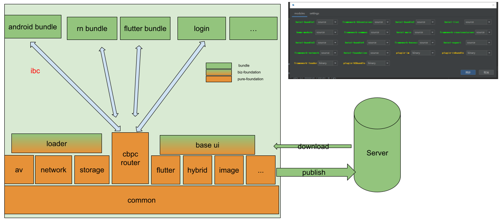

# To be Architect
> 驽马十驾功在不舍

> module assembler 是一款编排module以此获取 构建速度/启动速度/内存占用/包体积 最大收益的项目

先定义一下bundle和foundation,bundle是依附于app framework的native bundle、flutter bundle、react native bundle、hybrid bundle，有些bundle具有动态性能被app framework动态加载；foundation是赋予上层能力的基础服务，更像是一些用来快速开发页面的toolkits，比如网络、存储、图像、音视频都是foundation。bundle之间相互解耦，bundle之间的通信主要两种页面路由和rpc。

### 能力

声明了一些名词解释，我们来看看module assembler能提供怎么样的能力：

- 🚀 bundle多种加载方式：根据业务模块的重要性，可选择instant 、delay 、lazy 三种加载方式来优化构建速度/启动速度/内存占用等指标
- 📱 业务模块通讯IBC：自研IBC代码量少且容易使用
- ⌨️ 模块选择器：高效便捷的idea交互插件，让你像罗老师一样管理自己的各个小模块
- 免费maven仓库：提供免费的JamesfChen Snapshots(gradle.property文件 useJamesfChenSnapshots=true)，让你免去费时费力搭建组件maven
- 📚高效工程化脚本：使用命令行轻松完成模板创建，项目脚手架初始化等工作

### 技术方案对比

|框架| JIMU|module-assembler
|---|---|---|
工程脚手架 |×|√
模块选择idea插件| ×|√
模块加载| 支持立即加载|支持立即/延迟/懒加载
模块发布|支持静态模块|支持静态模块/动态模块
支持多种路由库|√|√
app集成方式|jar/aar/source静态集成|jar/aar/source/apk 动静结合集成

|框架通信库|Andromeda|ModularizationArchitecture|ARouter|WMRouter|IBC
|---|---|---|---|---|---|
...|...|...|...|...|...

### 原理
对于bundle的加载方式有如下三种：

- bundle立即加载(instant load)
- bundle延迟加载(delay load)
- bundle懒加载(lazy load)

回顾一下插件化与组件化

| 解耦的方式| 构建/执行  | 打包方式
|---|---|---|    
|组件化 |      编译时 |     aar/jar
|插件化 |      运行时 |     apk/dex

先来说说立即加载，通过dexbuilder在编译期间将aar/jar的dex整合到app的dex中，然后经过art加载执行。再来说说延迟加载 与 懒加载 ，两者的区别在于，前者会在MQ处于idle或者 draw end的阶段进行加载，不与界面的初始绘制抢夺cpu，后者使用时才会进行加载(在IBC接口调用时，才进行模块加载)。两者的共同点都是利用了插件化的技术实现，经由apkbuilder打包为apk，在安装加载时，会被extra出dex被ClassLoader加载 或者 直接被LoaderApk加载。
